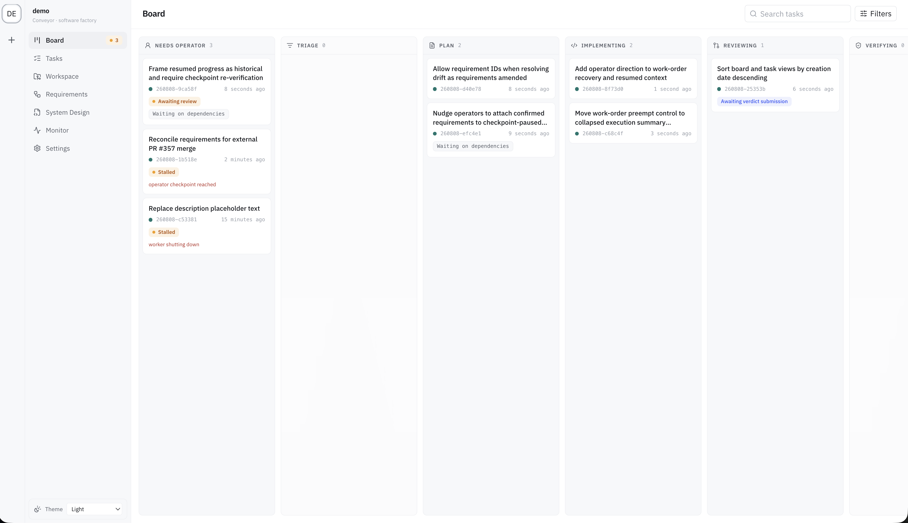

# Conveyor

Conveyor is a software factory. You describe what a product should be
in versioned documents (requirements, system design, decisions), and
the factory turns the gap between those documents and the code into
tasks. Agents you run on your own machines claim the tasks over MCP,
then plan, implement, and review them. Humans confirm the documents,
approve the plans, and gate the merges. Every step is recorded as an
event, and the events build a knowledge graph that links each merged
change back through its task, plan, review, and evidence to the
requirement it serves.



Conveyor has been building itself since July 2026. Nearly every feature
in this repository entered as a document, went through the plan and
review gates, and merged with its lineage recorded.

## The software factory

You can run a factory of agents dark, shipping code no human reads.
That feels fast for a few months, until nobody understands the system
anymore. Conveyor runs lit, with human judgment pushed as early in the
process as it will go:

- Work enters as requirements and design documents.
  Agents can draft and propose them; only an operator can confirm them.
- An optional plan gate has the agent submit a short written plan
  (approach, files, risks, done-criteria) for approval before it writes
  any code.
- Review runs in a separate agent session. The server rejects
  self-review at claim time, and a submission without test evidence is
  rejected outright.
- System Design documents declare which code they govern. A merge that
  touches governed code without a design revision raises a drift
  signal, and a monitor watches the default branch and files
  reconciliation tasks when changes land outside the pipeline.
- Every state transition appends to an event log. The knowledge graph
  is a projection of that log.

## The knowledge graph

Everything durable in the factory is a node — requirements and their versions, System Design documents,
decisions, tasks, work orders, pull requests, commit ranges, review
verdicts, test evidence — and every relationship between them is a
typed edge: a task *serves* a requirement, a design *governs* a
repository path, a decision *supersedes* an earlier one, a work order
*produced* a verdict, a merge records the commit range it landed.
Starting from any node you can walk to everything it touched: from a
requirement down to the commits that satisfied it, or from a merged
change back up to the intent it serves.

Nobody maintains the graph by hand, and the graph is not itself the
source of truth. Every edge is asserted by an event in the append-only
log and carries the ID of the event that created it. The links table
in PostgreSQL is a rebuildable projection: `conveyor lineage rebuild`
replays the workspace's events in a single transaction and regenerates
it, preserving the few historical rows no replay can derive.

The same graph serves every surface that needs context, through one
bounded, deterministic traversal — depth, node, and link budgets make
reads fail closed instead of walking an unbounded workspace:

- When an agent claims a work order, its context is assembled by
  walking the graph from the task: the requirements it serves, the
  designs governing the code it touches, and the decisions that
  settled how, ranked by relation and rendered within a byte budget.
- Drift detection follows the *governs* edges from System Design
  documents to repository paths to tell governed merges from
  ungoverned ones.
- Operators and API clients get the same walk through the lineage
  explorer in the dashboard and `GET /v1/lineage/{type}/{id}`.

The result is that traceability survives the people who had it in
their heads. When an agent (or a person) asks why something is the way
it is, the answer is a query. 

## The document tiers

Not every document carries the same weight. Conveyor sorts them by
two questions: does it bind anyone, and does it describe what the
product should do or how the system does it? That gives four tiers:

- **Product overviews** are background reading: markdown uploads,
  versioned with diffs, that describe the product without binding
  anyone to anything. When an overview makes a claim worth enforcing,
  the claim is promoted into a requirement with a link back to the
  exact section it came from.
- **Requirements** say what the product must do, framed as user
  stories with nested acceptance criteria. Every statement carries a
  stable ID — `REQ-n` for the requirement, `AC-n.m` for each
  criterion — so it can be cited on its own.
- **System Design documents** say how the system works, kept as
  markdown inside the factory. Each one also declares which code it
  governs, and that declaration is what arms drift detection — a
  merge into governed paths without a design revision raises a
  signal.
- **Decisions** are settled arguments. Each `DEC-n` records what was
  decided, the context, and the alternatives that were rejected, so a
  question argued once — in planning, in implementation, or by an
  operator — stays settled. A decision is never edited afterward,
  only superseded by a later one.

Requirements, designs, and decisions all move the same way: agents
and operators draft and propose, versions never change once written,
and only an operator confirms.

The IDs are stable and citable in code comments. An implementing agent
cites the requirements and decisions its code serves, and the reviewer
checks those citations against the document versions pinned when the
work order was claimed, so the contract the agent saw is the contract
it is judged by.

## How a task moves

1. **Plan.** In the in-product planning agent or an operator-side
   session (see the [planning playbook](docs/playbooks/conveyor-planning.md)).
   Output: proposed requirement and design revisions plus a
   dependency-ordered set of tasks.
2. **Queue.** Tasks carry their context with them: the requirements
   they serve and the designs that govern them. There are no priority
   fields and no assignees. Blocked is derived from dependencies, and
   workers claim whatever is claimable.
3. **Plan gate** (optional). A stage-typed work order collects a
   versioned execution plan for approval or redirect before
   implementation dispatches.
4. **Implement.** An agent you own (Codex, Claude, anything that
   speaks MCP) claims the work order, checks out a dedicated worktree,
   and does every edit, test, commit, and push there. Conveyor never
   executes your code and never holds your model credentials.
5. **Review.** A fresh agent session judges the diff against the cited
   acceptance criteria and the plan's done-criteria, and files a
   structured verdict that the server validates.
6. **Merge and watch.** Gated or automatic merge, then the monitor
   keeps watching the branch for out-of-pipeline changes and
   post-merge failures.

## Architecture

```
   Operators (browser)                  Agents (Codex, Claude, ...)
          |                                       |
   React dashboard                      MCP work-order server
   Board / Tasks / Docs                 claim, plan, review, verdict
          |                                       |
          +----------------+----------------------+
                           |
                    conveyord (Go, one binary)
              REST API, SSE planning chat, event log
                           |
                      PostgreSQL
             events, documents, links, one queue
                           |
                 conveyor worker (your machine)
             supervises your agents, your credentials
                           |
              git worktrees -> your repos -> PRs
```

Conveyor is a coordination plane, not an execution sandbox. The worker
is a thin supervisor over agents you already run. Edits and tests
happen in worktrees on your hardware, and delivery lands as ordinary
pull requests.

## Running it

An installed deployment needs PostgreSQL 15+, Git, an authenticated `gh` CLI
(`GH_TOKEN` is the headless alternative), an API key for its configured
OpenAI-compatible model endpoint, and the agent CLIs selected for execution.
The installer itself needs `curl`, `tar`, and a SHA-256 tool, but not sudo.

### Install a release

The latest release installs both `conveyor` and `conveyord` to
`~/.local/bin`:

```sh
curl -fsSL https://raw.githubusercontent.com/kidus-tiliksew/conveyor/main/install.sh | sh
```

Pin the reviewed installer and release version when reproducibility matters:

```sh
curl -fsSL https://raw.githubusercontent.com/kidus-tiliksew/conveyor/v1.2.3/install.sh | sh -s -- v1.2.3
```

Set `CONVEYOR_INSTALL_DIR` to override the destination. The script supports
Linux and macOS on amd64 and arm64, downloads only the selected GitHub release,
and verifies its published SHA-256 checksum before unpacking or replacing
either binary.

### Contributor agent setup

On each contributor machine, install the CLI and then install the factory's
embedded agent skills. The second command defaults to user-global Claude Code
skills under `~/.claude/skills`; pass `--project` to keep them in the current
project instead.

```sh
curl -fsSL https://raw.githubusercontent.com/kidus-tiliksew/conveyor/main/install.sh | sh
conveyor skills install
```

`conveyor skills install --list` shows the release-carried files and their
installed state without writing. Re-running the install refreshes only files
previously owned by Conveyor and refuses unrelated collisions.

To upgrade, re-run the installer with the newer version and restart the
`conveyord` service. Replacing the two binaries is the entire software upgrade:
startup applies pending database migrations, while a binary refuses to start
against a store created by a newer release.

### Build from source

Development requires Go 1.24, Node/npm, Docker with Compose, and the runtime
prerequisites above. Clone the repository and run `make build`; the binaries
are written to `bin/`. This source-build path remains the supported devbox flow.

### Four-step solo quickstart

With a released `conveyor`/`conveyord` installation and PostgreSQL 15 or newer
already running, the first-run wizard creates the deployment and workspace
configuration; no hand editing of YAML is required.
Issue yourself a personal token immediately after your first sign-in.
Treat the environment token as break-glass and rotate it through
`CONVEYOR_API_TOKEN`, not the Revoke button.

1. Export `CONVEYOR_DATABASE_URL`, a generated `CONVEYOR_API_TOKEN`, and
   `CONVEYOR_API_KEY`, then authenticate the host with `gh auth login`.
2. Run `conveyor init --config ./conveyor.yaml` and answer the organization,
   first-operator, workspace, and repository prompts. The repository path must
   be an existing filesystem clone. Re-running the same answers is a safe
   no-op.
3. Start the versioned binary with `conveyord -config ./conveyor.yaml` (or use
   `conveyord install --config ./conveyor.yaml` and inspect it with
   `conveyord status`). Startup applies pending embedded migrations before the
   API or workers start; replacing the binary and restarting is the upgrade
   procedure.
4. Create the first task with
   `conveyor --workspace <workspace-id> task new --repo <repo-name> --message '<work>'`.

On a team server, use a dedicated forge machine account for the host's `gh`
login. Every forge action performed by the factory is authored as that host
identity, so a personal account makes ownership and auditing ambiguous.

```sh
cp conveyor.example.yaml conveyor.yaml
cp .env.example .env   # set CONVEYOR_API_KEY; regenerate the operator token: openssl rand -hex 32
make dev               # health-checked Postgres on :5432 + build + conveyord on :8080
```

Open `http://127.0.0.1:8080`. The Board and Tasks views are the
operating surfaces, and `http://127.0.0.1:8080/settings` has the MCP
endpoint with a paste-ready client snippet.

After installing the skills, connect the contributor CLI and MCP client with a
personal access token from Settings. The CLI reads the token through hidden
terminal input and verifies it before saving; it is never passed in argv. The
Settings page also provides the MCP endpoint and paste-ready client snippet.

```sh
bin/conveyor --server http://127.0.0.1:8080 auth login
bin/conveyor config set workspace demo
bin/conveyor auth status
```

Credentials and workspace defaults are stored per server, so one machine can
use multiple factories. The local JSON file uses a plaintext-at-rest trust
model like `gh` and kubeconfig, with a 0700 parent directory and 0600 file;
operating-system keychain integration may be added later. Use
`conveyor auth logout --revoke` to remove the local entry and attempt remote
revocation. `conveyor config list` shows the effective server and workspace and
whether each came from a flag, environment, the stored file, or singleton
fallback.

Environment variables remain the supported non-interactive path for CI,
workers, and MCP clients. They take precedence over stored values:

```sh
export CONVEYOR_ADDR=https://factory.example.com
export CONVEYOR_API_TOKEN="$(conveyor --server "$CONVEYOR_ADDR" auth token)"
export CONVEYOR_WORKSPACE=demo
```

Start a worker on the machine where your agents run:

```sh
bin/conveyor config init-execution --config ./conveyor.yaml     # required local launch setup
bin/conveyor --workspace demo worker pair                      # prints a single-use pairing token
bin/conveyor --workspace demo worker run --config ./conveyor.yaml --pairing-token <t>
```

Upgrade note for solo Mac and devbox workers: create the local execution setup
before replacing the binary while worker mode is enabled. Workers no longer
read harness, model, or effort choices from the server's persisted workspace
copy. If the file is missing or invalid, startup fails before any claim and
prints the config path plus the setup command needed to repair it. Set
`CONVEYOR_CONFIG` when a service or working directory should use a path other
than `./conveyor.yaml`.

File work from the CLI:

```sh
bin/conveyor --workspace demo task new --repo api --message 'fix the typo in README'
```

or over MCP with `create_task` (idempotent; `body`, `repo`, and a
caller-stable `idempotency_key` are required, and you can attach served
requirements and governing designs at intake). Any MCP-speaking agent
can claim work orders, submit plans, and file review verdicts with
`CONVEYOR_API_TOKEN`. `CONVEYOR_API_KEY` powers only the server-owned
triage and planning stages. Both binaries auto-load `.env`; process
environment wins over stored CLI defaults.

## Status

Conveyor is in active development. The factory's own records carry the
full history, defects included.
