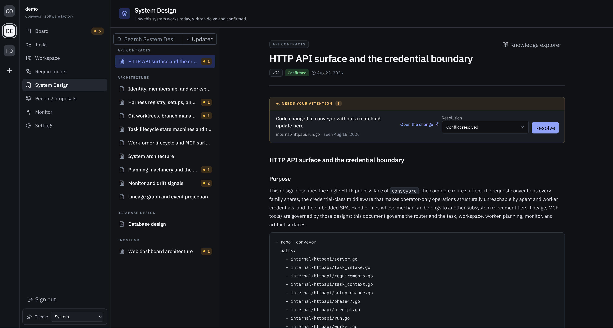

# Misalignment

<a href="assets/screenshots/system-design-drift.png">
  
</a>
<sub>A governed path changed without this design; the operator picks the resolution</sub>

Conveyor's core wager is that generating code is no longer the hard part;
noticing when the code and the confirmed intent disagree is. Misalignment
detection is how the factory notices. It compares three things that can
drift apart: confirmed intent (the corpus), delivered changes, and the
observed repository. When two of them disagree, it raises a signal.

Nothing here blocks a merge, rewrites a document,
or reverts a commit. A signal puts a disagreement in front of a human operator
with enough context to judge it, and every path forward runs through the
normal machinery. The one exception is narrow and deliberate: a
task's own undecided proposals block that task's review claim, because
reviewing against authority the task itself is trying to change would be
circular.

There are three detection machines:

| Machine | Compares | Operator verb |
|---|---|---|
| Repository and design drift | observed repository changes vs governed paths and the pipeline | resolve, with an outcome |
| Delivery staleness | merged deliveries vs the requirement version they were planned against | dismiss, or file a follow-up |
| Pending proposals | authored revisions vs operator confirmation | confirm or dismiss |

## Repository and design drift

The [monitor](#the-monitor) watches configured repositories and classifies
every new commit: a merge of a factory task branch with recorded lineage is a
lineaged merge; anything else is a direct push, an external PR merge, or a
revert. Everything except a post-merge CI failure counts as a change to the
repository, and out-of-pipeline changes (direct pushes, external merges,
reverts) always raise drift and file a reconciliation task.

Design drift is sharper. Every confirmed System Design document declares the
paths it governs in its `conveyor:governs` code block
([details](document-corpus.md#system-design-documents)). When any observed
change, including the factory's own merges, touches governed paths, Conveyor
checks whether the delivering work already accounted for the design:

- If the task proposed a revision to that design before merging, no drift.
  The proposal is the accounting.
- If the design was attached to the task as pinned context and the merge came
  through the pipeline, no drift; a consultation event is recorded instead,
  and the design's page shows the delivery consulted it.
- Otherwise, a drift record is written against that design version, with the
  matching paths and the causal merge event.

This is why the task-filing convention says to name the governing design and
state whether the change alters the documented mechanism: a task that engages
with its governing design honestly never trips the wire.

Resolving drift is an audited judgment with four outcomes:

- `requirements_amended`: the change was intentional and intent should catch
  up. Conveyor auto-drafts an amendment proposal on the requirement you name,
  clearly marked as drift-originated. It is a proposal like any other; the
  existing confirmation stays authoritative until you confirm.
- `design_document_updated`: accepted only once a newer version of the
  drifted design is actually confirmed.
- `conflict_resolved`: judged and settled without a document change.
- `change_reverted`: the repository was put back.

Resolution lives on the Monitor page, the affected document pages, or
`conveyor monitor resolve <drift-id> --outcome <outcome>`.

## Delivery staleness

Drift watches the repository; staleness watches time. A requirement is
confirmed at version 2 while a task planned against version 1 is still in
flight. The merge lands. Nothing is wrong with the code, but the delivery no
longer demonstrably serves current intent.

Staleness is derived, not stored: on every read of a requirement, Conveyor
walks the deliveries reachable through its serving links and flags any merge
that needs attention, with a plain-language reason:

- planned against v1; v2 was current at merge
- planned requirement version unavailable
- merged outside factory review
- delivered through related work without serving this requirement

Each flagged delivery gets a content-addressed signal ID, so if the facts
change (a new version, a new merge), it is a new signal; acknowledging one
never mutes the next. When the delivery graph is too large to walk within
budget, Conveyor says so explicitly ("staleness could only be partially
evaluated") rather than pretending absence of evidence is evidence of
absence.

The operator has two moves, on the requirement page or over the API:
acknowledge (the delivery is fine; an append-only watermark records the
judgment) or file a follow-up (a normal gated task is created to
investigate, and the signal points at it until the follow-up resolves).

## Pending proposals

The third machine is the simplest: authority the operator still owes the
factory. Every unconfirmed proposal across the four tiers (requirement
versions, System Design versions, decisions, and suggested task context)
is projected onto one Pending proposals page with its origin and age, and
rolled into the sidebar and board attention counts.

Proposals never gate work in general; agents propose fire-and-forget and
keep implementing. The one exception, noted above: a review cannot be
claimed while the task under review has its own authored proposals still
undecided. The task page shows this state directly, with the confirm action
in place. Deciding the proposal either way, confirm or dismiss, releases the
review. Dismissing a pending requirement or System Design version requires an
explicit confirmation step, retains the version in history, and makes that
version permanently unavailable for later confirmation.

## Review-time governance

Detection would be hollow if reviews did not actually check against
authority, so the review contract is structural rather than aspirational.

At review claim, the served requirements and the governance snapshot
(governing design content, confirmed and superseded decisions) are pinned
immutably onto the work order. The verdict must include assessments that
classify against exactly that pin: which REQ and AC IDs the delivery cites,
which citations are unknown or unserved, which decisions were applicable,
and which cited authority is superseded, all as disjoint lists the server
validates. A reviewer cannot cite authority that was not pinned, cannot file
findings when no authority exists, and cannot wave through a superseded
citation as current.

Proposal evidence from the task rides along, explicitly marked as conferring
no authority. A plan that reduces a proposable authority conflict to a bare
"pause and ask the operator" without proposing anything is itself a blocking
review finding: the factory's posture is propose first, then ask.

## The monitor

The monitor is the component that feeds the drift machine. It is opt-in and
scoped in the deployment config:

```yaml
monitor:
  enabled: true
  repositories: [api]
  poll_interval: 1m
  startup_window: 24h
```

It polls with the daemon's read-only GitHub credential, and it can only do
one thing with what it finds: file ordinary gated tasks through the same
intake path as everyone else. It cannot claim, review, merge, or deploy.
Post-merge CI failures on factory commits become reconciliation tasks too,
and a later all-green run on the same lineage records a recovery observation
against the open task rather than filing a new one.

Deduplication is layered so a red streak does not become a task flood: every
observation has a durable identity keyed by kind, repository, and
occurrence, re-observations count against the existing record; open
monitor-filed tasks for the same repository and kind are reused; and intake
idempotency backstops both.

`conveyor monitor status` and the Monitor page report health: last successful
observation, current error and its forge error category, retry backoff, and
unreconciled drift with its age.

## What operators actually watch

In practice the attention surfaces reduce to three numbers: pending
proposals, requirement attention (staleness plus drift plus pending
versions), and unreconciled drift on the Monitor page. All three roll into
the dashboard's badges. An operator who clears those three queues has, by
construction, judged every disagreement the factory knows about between its
intent, its deliveries, and its repository.
