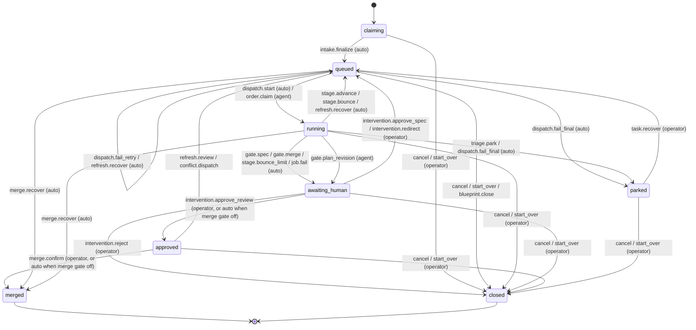
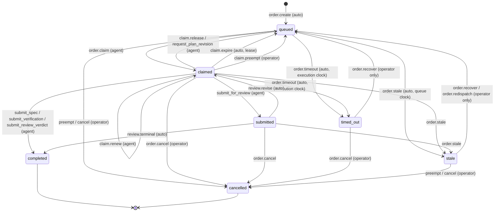
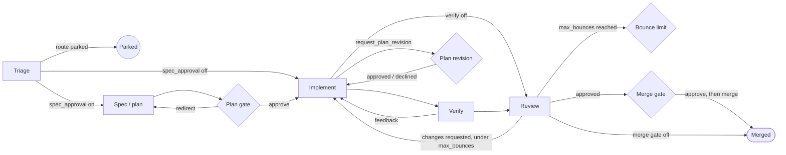

# Conveyor operator UX — verified analysis

Worktree `agent-hub-state-visuals` at `1c70303e` (`origin/main`); citations verified against 1c70303e.
All citations are repo-relative `file:line` in this worktree and were read in code.
`[INFERENCE]` marks anything not read directly.
The memory store formerly in `internal/store/store.go` is now split across files such as `internal/store/tasks_store.go`, `internal/store/work_orders_store.go`, and `internal/store/lifecycle_store.go`; the PostgreSQL mirror lives in `internal/store/postgres/work_orders_store.go`.
All store citations use full paths.

Corpus caveat: the live corpus (`https://conveyor.kidus.sh`, workspace `demo`) was not read, because the brief does not authorize live-service access.
Authority IDs below are the ones the code itself cites in traceability comments at the cited lines.
Their wording must be checked against the confirmed corpus before any proposal is filed.

## Contents

1. [Summary](#1-summary)
2. [Task state machine](#2-task-state-machine)
3. [Work-order state machine and clocks](#3-work-order-state-machine-and-clocks)
4. [Stage path and gates](#4-stage-path-and-gates)
5. [How "needs operator" is computed](#5-how-needs-operator-is-computed)
6. [Every operator stop: judgment or mechanical](#6-every-operator-stop-judgment-or-mechanical)
7. [Verification grants and kits](#7-verification-grants-and-kits)
8. [What agents and operators can see and do](#8-what-agents-and-operators-can-see-and-do)
9. [FunnelFlux input claims checked against code](#9-funnelflux-input-claims-checked-against-code)
10. [Mechanical stops that can be automated or collapsed](#10-mechanical-stops-that-can-be-automated-or-collapsed)

## 1. Summary

- The task machine has 8 states; 5 different gates (spec, plan revision, merge, bounce limit, job failure) all land in the one state `awaiting_human` (`internal/core/lifecycle.go:104`).
  The code says so itself: "task state alone is ambiguous because all operator gates share TaskAwaiting" (`internal/dispatch/dispatch.go:1500-1502`).
- "Needs operator" on the board is an OR of 6 unrelated conditions computed in the browser (`web/src/lib/activity.ts:83-88`); the server's attention flag is an OR of 9 (`internal/store/tasks_store.go:23-26`).
  Neither says who must act or what kind of act it is.
- There are four separate "what is going on" derivations: `StalledTask` (`internal/store/tasks_store.go:214-246`), `taskRunGate` (`internal/httpapi/run.go:328-398`), `gateBadge` (`web/src/lib/activity.ts:220-229`), and `deriveCurrentExecutionState` (`web/src/lib/activity.ts:487`).
  The CLI sees a gate only through `conveyor run` and `conveyor task wait`, which reads the same run-order gate projection (`cmd/conveyor/task_wait.go:20-24,35-47`); MCP `get_task` returns only `state` and `next_stage` (`internal/httpapi/mcp_reads.go:308-311`).
- Of 23 distinct operator-stop situations found, 9 are judgment, 9 are mechanical, and 5 are mixed (table in §6).
- Every gate-clearing act is restricted to user credentials (`internal/httpapi/server.go:492`); a dispatched agent credential is refused.
  Recover and redispatch have no CLI command; merge (`conveyor task merge`, `cmd/conveyor/main.go:467-482`) and grants (`conveyor verification permissions grant`, `cmd/conveyor/verification_permissions.go:21-25,52`) now do.
- A timed-out work order with no retry suppression is not flagged as stalled (`internal/store/tasks_store.go:223-232`), so the board can show such a task as still "Verifying" with no alarm.
- With the merge gate on, merging takes two operator acts for one decision: `approve_review` then `merge.confirm` (`internal/core/lifecycle.go:105-106`; `web/src/components/task/review-panel.tsx:86-116`).
  The new `conveyor task merge` is the CLI form of the second act only: "Approval never merges; with the merge gate on, the task stays approved until this act or the dashboard's Merge" (`cmd/conveyor/main.go:463-482`).
- The server already renders the full lifecycle as mermaid (`internal/core/lifecycle.go:214-223`, route `internal/httpapi/server.go:308`); the web client function `fetchLifecycleDiagram` (`web/src/lib/api.ts:925-927`) has no caller in `web/src`.
  There is no per-task flowchart anywhere in the UI.

## 2. Task state machine

States: `claiming`, `queued`, `running`, `awaiting_human`, `approved`, `merged`, `closed`, `parked` (`internal/core/types.go:157-164`).
The closed transition table is `internal/core/lifecycle.go:101-108`; PostgreSQL enforces the same set through migration 035's `{{task_states}}` CHECK, rendered from `core.TaskStates()` (`internal/store/postgres/migrations/035_canonical_lifecycle_states.sql:5-7`; `internal/store/postgres/migrate.go:589-594`).
Governing design cited in code: `component-task-lifecycle` (`internal/core/lifecycle.go:10,117,216`).

| From | Command | To | Actor | Site |
|---|---|---|---|---|
| claiming | intake.finalize | queued | auto | `internal/dispatch/dispatch.go:1663-1670` |
| queued | dispatch.start / order.claim | running | auto / agent | `internal/dispatch/dispatch.go:1346`; claim path |
| queued | dispatch.fail_final | parked | auto | `internal/core/lifecycle.go:103` |
| running | stage.advance | queued | auto | `internal/dispatch/dispatch.go:933` |
| running | stage.bounce (invalid output, under limit) | queued | auto | `internal/dispatch/dispatch.go:908` |
| running | stage.bounce_limit | awaiting_human | auto | `internal/dispatch/dispatch.go:904-906`; review path `internal/store/changes_requested.go:127-128` |
| running | job.fail | awaiting_human | auto | `internal/dispatch/dispatch.go:602,1352` |
| running | triage.park | parked | auto | `internal/dispatch/dispatch.go:924-925` |
| running | gate.spec | awaiting_human | auto | `internal/dispatch/dispatch.go:995-996` [StateMachineScout] |
| running | gate.plan_revision | awaiting_human | agent (`request_plan_revision`) | `internal/store/lifecycle_store.go:58` [OperatorStopsScout] |
| running | gate.merge | awaiting_human | auto (review round approved) | `internal/store/work_orders_store.go:1122` |
| awaiting_human | approve_spec / redirect | queued | operator | `internal/core/lifecycle.go:105` |
| awaiting_human | approve_review | approved | operator, or auto in the same write when merge gate is off | `internal/store/work_orders_store.go:1151-1170` |
| awaiting_human | reject | closed | operator | `internal/core/lifecycle.go:105` |
| approved | merge.confirm | merged | operator, or auto when merge gate is off | `internal/core/lifecycle.go:106`; `internal/dispatch/dispatch.go:1156-1157` [StateMachineScout] |
| approved | refresh.review / conflict.dispatch | queued | auto / operator ("Fix merge conflict") | `internal/core/lifecycle.go:106`; `web/src/components/task/review-panel.tsx:87-96` |
| parked | task.recover | queued | operator | `internal/core/lifecycle.go:107` |

Notes.

- The bounce limit lands in `awaiting_human`, not `parked` (`internal/core/lifecycle.go:104`; `internal/store/changes_requested.go:127-128`).
  OperatorStopsScout's draft said `parked`; the code says otherwise.
- There is no `running → approved` edge, so auto-approval with the merge gate off writes `awaiting_human` and `approved` in one write; the code calls this a "gap workaround … until a table amendment supplies the intended command" (`internal/store/work_orders_store.go:1164-1167`).
- Stage is orthogonal to state: `next_stage` and `recovery_stage` sit on the task (`internal/core/types.go:210-211` [SurfaceScout]); stages are triage, spec, implement, verify, review, gate, merge, monitor (`internal/core/types.go:93-100` [StateMachineScout]).

## 3. Work-order state machine and clocks

States: `queued`, `claimed`, `submitted`, `completed`, `cancelled`, `stale`, `timed_out` (`internal/core/types.go:540-546`); table `internal/core/lifecycle.go:110-119`.
There is no `released` state; release is `claimed → queued`.

| Clock | Expiry effect | Who clears it | Site |
|---|---|---|---|
| Queue deadline (default 24h) | never-started `queued` → `stale`; paused while a dependency blocks | operator `redispatch` or `recover` | `internal/store/postgres/work_orders_store.go:1591-1613,1628-1633` |
| Execution deadline (fixed at first claim, never extended) | `queued`/`claimed` → `timed_out`; job marked `failed` | operator `recover` only | `internal/store/postgres/work_orders_store.go:1614-1619,1683-1691` |
| Claim lease (default 5 min, renewable) | `claimed` → `queued` with outcome `expired`; `retry_suppressed = true` unless the claimant is a `conveyor run` session | operator `recover` | `internal/store/postgres/work_orders_store.go:1621-1626,1641-1655` |

The sweep runs as a queue job, `orderClockWorker` → `Plane.TickOrderClock` (`internal/dispatch/queue.go:100-110`; `internal/taskops/taskops.go:201-218` [StateMachineScout]).

Retry bookkeeping on release (`internal/store/work_orders_store.go:563-635`):

- An outcome that consumes a retry increments `AutomaticRetryCount` up to a limit of 3 by default (`internal/store/work_orders_store.go:587-590`), with backoff (`internal/store/work_orders_store.go:606-610`).
- An identical consecutive failure (same outcome, same non-empty detail, not transient connectivity) suppresses retry immediately (`internal/store/work_orders_store.go:599-604`).
- Hitting the limit suppresses retry (`internal/store/work_orders_store.go:613-615`).
- Any release outcome that does not consume a retry (for example a checkpoint) also suppresses retry (`internal/store/work_orders_store.go:624-630`).
- Operator recover resets `RetrySuppressed` and `AutomaticRetryCount` (`internal/store/work_orders_store.go:2280-2282`), re-freezes the setup to current config (`internal/workorder/service.go:387-391`), and re-queues; it is refused while a plan revision is pending (`internal/workorder/service.go:377-386`).

Governing documents cited in code: `component-task-lifecycle` for the W13/W14 recover and redispatch edges (`internal/core/lifecycle.go:116-118`); `component-work-orders` (`internal/store/submission_store.go:35`; `internal/worker/service.go:107-108`).

## 4. Stage path and gates

| Gate | Configured | Enforced | Cleared by | Authority cited in code |
|---|---|---|---|---|
| Spec / plan approval | `task.SpecApproval`, frozen at intake (`internal/core/types.go:195`) | `internal/dispatch/dispatch.go:930-933` (route), `:995-996` (gate) | operator `approve_spec` / `redirect` / `reject` | REQ-3 AC-3.1, DEC-17 (`internal/dispatch/dispatch.go:928-929`) |
| Merge approval | `task.MergeApproval` (`internal/core/types.go:196`) | `internal/store/work_orders_store.go:1122,1151-1153` | operator `approve_review`, then `merge` | `component-task-lifecycle` |
| Bounce limit | workspace `max_bounces`, default 10 [docs/tasks.md:213-214] | `internal/store/changes_requested.go:127-134`; `internal/dispatch/dispatch.go:903-906` | operator redirect / reject / approve; window counts since last human intervention (`internal/store/work_orders_store.go:1131-1134`) | — |
| Plan revision | agent verb `request_plan_revision` | `internal/store/lifecycle_store.go:24-102` [OperatorStopsScout]; recover refused while pending (`internal/workorder/service.go:377-386`) | operator review with `plan-revision-approved/declined/rejected` (`internal/dispatch/dispatch.go:1495-1497`) | REQ-2 AC-2.1, `component-work-orders` (`internal/workorder/service.go:382-384`) |
| Hold | `task.Hold` | worker claim filter (`internal/worker/service.go:687,777-778` [StateMachineScout]) | operator | — |
| Assignee | `task.Assignee` | `internal/worker/service.go:690` [StateMachineScout] | operator / agent with `set_assignee` | DEC-18 (AGENTS.md) |
| Dependencies | `depends_on`, `add_task_dependency` | implement/verify claim refused while blocked; queue clock paused (`internal/store/postgres/work_orders_store.go:1581-1613`) | dependency merges; unlink if unsatisfiable | — |
| Retry suppression | not configurable except `AutomaticRetryLimit` | `internal/store/work_orders_store.go:579-630` | operator recover | — |
| Verification grant | per work-order attempt | `internal/store/verification_lifecycle.go:150-168` | operator `POST /v1/work-orders/{id}/verification/permissions` (`internal/httpapi/server.go:345`) | `req-verification-kits`, `component-verification-kit-contract` (`internal/verification/manifest.go:1-2`; `internal/verification/selection.go:73-75`) |

## 5. How "needs operator" is computed

| Layer | Rule | Site |
|---|---|---|
| Server attention flag | `awaiting_human` OR `parked` OR forge failure OR review recovery OR interrupted review recovery OR stalled OR pending authority OR pending context OR user changes requested | `internal/store/tasks_store.go:23-26` |
| Server stalled reason | latest `queued`/`stale`/`timed_out` order with: unsatisfiable dependency; or `retry_suppressed`; or `stale`; or ≥2 automatic retries with a message | `internal/store/tasks_store.go:214-246` |
| Board column "Needs operator" | stalled OR forge failure OR pending authority OR state ∈ {`awaiting_human`, `approved`, `parked`} | `web/src/lib/activity.ts:83-88` (authority comment: REQ-2 AC-2.2; REQ-3; `component-web-dashboard`, `:78-82`) |
| Board chip | first match of Triage failed / Stalled / Ready to merge / Awaiting proposal decision / Needs a route / Awaiting review / Needs attention | `web/src/lib/activity.ts:220-229` |
| `conveyor run` gate | only when `awaiting_human`: plan_revision, spec, merge, else "human" | `internal/httpapi/run.go:328-398` [SurfaceScout] |
| Personal inbox API | `GET /v1/attention/tasks`, scoped to the caller; the client function `fetchCallerAttentionTasks` (`web/src/lib/api.ts:265-267`) has no caller in `web/src` | `internal/httpapi/server.go:224,1431-1461` (DEC-19, `req-260810-23b69f` REQ-3) |

Consequences, each read in code:

- A spec gate and a merge-gate pre-approval both render the chip "Awaiting review" (`web/src/lib/activity.ts:227`).
- `approved` (ready to merge) is in the Needs-operator column even when the merge gate is off and Conveyor is merging on its own (`web/src/lib/activity.ts:88`; auto-merge `internal/dispatch/dispatch.go:1156-1157` [StateMachineScout]).
- A `timed_out` order with `retry_suppressed = false` and fewer than 2 retries has no stalled reason (`internal/store/tasks_store.go:223-232`), so the task stays in its stage column with no chip, although only an operator recover can move it.
- The task-page panel for a `job.timeout` incident says "The last stage timed out" and offers the primary button "Approve" (`web/src/components/task/review-panel.tsx:135-143`), which asks the operator to approve work that never finished.

## 6. Every operator stop: judgment or mechanical

Test applied: would a reasonable owner choose differently depending on what the page shows?
"User-only" means the endpoint requires a user credential (`internal/httpapi/server.go:492`); MCP refuses human-reserved tools to agent credentials (`internal/httpapi/mcp.go:145-147,543-558`).

| # | Situation | Raised at | Cleared by (what it does) | Class | Why |
|---|---|---|---|---|---|
| 1 | Plan (spec) approval | `internal/dispatch/dispatch.go:995-996` | `POST /tasks/{id}/review` approve / redirect / reject; transitions per table | JUDGMENT | The plan's content decides the answer. |
| 2 | Merge approval (gate on) | `internal/store/work_orders_store.go:1122` → `awaiting_human` | approve (`→ approved`), then a second act `POST /tasks/{id}/merge` (`internal/httpapi/server.go:330`; CLI `conveyor task merge`, `cmd/conveyor/main.go:463-482`) | JUDGMENT, but two acts | One ship decision split into two acts. |
| 3 | Merge conflict at `approved` | merge readiness `CONFLICTING` (`web/src/components/task/review-panel.tsx:87-96`) | `POST /merge-conflict-fix` → `conflict.dispatch` | MECHANICAL | The fix is always "dispatch a merge-base fix"; no choice. |
| 4 | Forge publication failure | events `github_issue.publication_failed`, `review.publication_failed`, `merge.failed` (`internal/store/git_publications_store.go:15-91` [OperatorStopsScout]) | retry / refresh | MECHANICAL | Retrying a GitHub write. |
| 5 | Conflict dispatch exhausted | `merge.conflict_dispatch_exhausted` (same) | operator | MIXED | Repeated failed merges may need a human. |
| 6 | Review bounce limit | `internal/store/changes_requested.go:127-134` → `awaiting_human` | redirect with feedback / approve / reject | JUDGMENT | Reviewers and implementer disagree; the owner decides who is right. |
| 7 | Invalid-output bounce limit | `internal/dispatch/dispatch.go:903-906` | same as #6 | MIXED | Usually model or tooling trouble, sometimes a bad spec. |
| 8 | Triage park | `internal/dispatch/dispatch.go:924-925` | `task.recover` / close | JUDGMENT | Triage said the task should not proceed as written. |
| 9 | Dispatch fail-final park | `dispatch.fail_final` (`internal/core/lifecycle.go:103-104`) | recover | MECHANICAL | Re-queue. |
| 10 | In-process job failure (`job.fail`) | `internal/dispatch/dispatch.go:594-602,1332-1353` | approve / redirect | MIXED | Authority-budget failure names a config fix (`:1337-1340`); other failures are retries. |
| 11 | Stale order (queue deadline) | `internal/store/postgres/work_orders_store.go:1628-1633` | `POST /tasks/{id}/redispatch`: fresh queue deadline | MECHANICAL | Nothing claimed it in 24h; redispatch puts the same order back. |
| 12 | Timed-out order (execution deadline) | `internal/store/postgres/work_orders_store.go:1614-1619` | `POST /work-orders/{id}/recover`: reset counters, re-freeze, re-queue (`internal/store/work_orders_store.go:2280-2282`) | MECHANICAL | Restart button. Not even flagged stalled (§5). |
| 13 | Lease expiry → retry suppressed | `internal/store/postgres/work_orders_store.go:1641-1655` | recover | MECHANICAL | Agent died; same restart. |
| 14 | Retry limit reached (different failures) | `internal/store/work_orders_store.go:613-615` | recover | MECHANICAL | Bounded retries already ran; one more is a guess unless the failure is read. |
| 15 | Identical consecutive failure | `internal/store/work_orders_store.go:599-604` | recover | MIXED | A blind retry repeats it; the owner should see the failure text, or a dependency should be declared. |
| 16 | Agent checkpoint with `decision_request` | `internal/store/work_orders_store.go:624-630`; `internal/worker/service.go:1000-1019` [OperatorStopsScout] | recover, which accepts an operator `direction` (`internal/httpapi/phase47.go:99-103,122`) | JUDGMENT | The agent asked a question; today the UI calls the answer "Recover". |
| 17 | Plan revision request | `internal/store/lifecycle_store.go:24-102` [OperatorStopsScout] | review with plan-revision reason codes | JUDGMENT | The approved plan cannot be executed as written. |
| 18 | Reviewer timed out / contradictory seat | `internal/store/work_orders_store.go:261-314` [OperatorStopsScout] | `POST /review-round/retry` | MECHANICAL | Starts a new round. |
| 19 | Interrupted review seats | `internal/store/work_orders_store.go:152-205` [OperatorStopsScout] | `POST /review-round/recover` | MECHANICAL | Re-queues the seats. |
| 20 | Verification `operator_action_required` | `internal/store/verification_completion.go:75-101` [OperatorStopsScout] | recover with disposition applied / not_applied | JUDGMENT | Only a person can say whether an external operation took effect. |
| 21 | Missing verification grant | `internal/store/verification_lifecycle.go:155-165`; `internal/verification/permissions.go:111-143` | `POST /work-orders/{id}/verification/permissions`; web `VerificationPermissions` (`web/src/components/task/verification-permissions.tsx:43`, mounted at `web/src/components/task/verification-entry.tsx:157`); CLI `conveyor verification permissions grant` (`cmd/conveyor/verification_permissions.go:48-52`) | MIXED | Network, credential, or write scope is a decision; a read-only check is a rubber stamp. |
| 22 | Document / context proposal pending | `internal/store/pending_proposals.go:153-182` [OperatorStopsScout] | confirm / dismiss (`confirm_documents`) | JUDGMENT | Changes authority. |
| 23 | Monitor drift | monitor | resolve | JUDGMENT | Owner decides whether drift matters. |

Not stops but shown as "needs operator": `approved` with the merge gate off (#24, Conveyor is acting), and user-requested changes pending until implement is claimed (`internal/store/changes_requested.go:27-46` [OperatorStopsScout]).

Totals from this table: JUDGMENT 9 (#1, 2, 6, 8, 16, 17, 20, 22, 23), MECHANICAL 9 (#3, 4, 9, 11, 12, 13, 14, 18, 19), MIXED 5 (#5, 7, 10, 15, 21).

## 7. Verification grants and kits

- A kit is a repository manifest entry with `governing_pins` and exercises (`internal/verification/manifest.go:30-84` [OperatorStopsScout]).
- Kit eligibility requires every pin to be an exact (kind, id, version) member of the task's authoritative snapshot (`internal/verification/selection.go:73-76`; `req-verification-kits` AC-2.1–2.4).
  So confirming a newer requirement version makes every kit pinned to the old version ineligible until the manifest is bumped; this matches the FunnelFlux report of an integrations kit pinned to v3 while the requirement is at v9.
- Every attempt start requires a live grant (`internal/store/verification_lifecycle.go:155-158`), and every requested action needs both the work-order grant and a local host grant (`internal/verification/permissions.go:111-143`).
  There is no read-only exemption in code; `RequireVerificationPermissions` over an empty action list passes, but `verificationLiveGrant` still requires a grant row [INFERENCE from `:175` order of checks; the grant lookup runs before action matching].
- Retry authority for verification is only issued through typed operator recovery; an agent-side authorize-retry is refused (`internal/store/verification_lifecycle.go:127-131`).
- The grant endpoint (`internal/httpapi/server.go:345`) now has a web dialog gated on `operate_gates` (`web/src/components/task/verification-permissions.tsx:43-44`) and a CLI `verification permissions inspect|grant|revoke` (`cmd/conveyor/verification_permissions.go:21-25`); MCP has no grant tool (`cmd/conveyor/verification_permissions.go:18-20`).

## 8. What agents and operators can see and do

| Need | Web | CLI | MCP |
|---|---|---|---|
| "Why is this task not moving?" | task page banner from `deriveCurrentExecutionState` (`web/src/lib/activity.ts:487`) | inside `conveyor run` (`cmd/conveyor/run_cmd.go:187-213` [SurfaceScout]) and `conveyor task wait`, which reports the pending gate (`cmd/conveyor/task_wait.go:35-47`); `task show` dumps raw JSON | `get_task`: state and next_stage only (`internal/httpapi/mcp_reads.go:308-311`) |
| Approve plan / review | review panel | `task approve|reject|redirect` (`cmd/conveyor/main.go:543-568` [SurfaceScout]) | none |
| Merge | review panel | `task merge` (`cmd/conveyor/main.go:463-482`), approved tasks only | none |
| Recover / redispatch | recovery cards | none (`client.redispatchTask` has no command [SurfaceScout]) | `redispatch_work_order`, human-reserved (`internal/httpapi/mcp.go:553,592`) |
| Grant verification permission | grant dialog (`web/src/components/task/verification-permissions.tsx:43`) | `verification permissions grant` (`cmd/conveyor/verification_permissions.go:52`) | none |
| Personal inbox | API exists, no page uses it (`web/src/lib/api.ts:265-267`) | none | none |

Authorization:

- All operator mutations require a user credential (`internal/httpapi/server.go:492`); the extra CSRF/origin proof applies only to browser sessions (`internal/httpapi/server.go:713-722`).
  A user personal access token used from a terminal can therefore call every operator endpoint today; the boundary is credential kind and capability, not presence.
- `maintainer` holds `operate_gates` and `recover_work` but not `confirm_documents`; `operator` holds all (`internal/core/authorization.go:19-90` [OperatorStopsScout]).
- No CLI command named `task status`, `recover`, or `redispatch` exists; `task wait` (`cmd/conveyor/task_wait.go:120`), `task merge` (`cmd/conveyor/main.go:469`), and `verification permissions grant` (`cmd/conveyor/verification_permissions.go:52`) now do (grep of `Use:` strings in `cmd/conveyor`).

## 9. FunnelFlux input claims checked against code

| Claim (FunnelFlux operator experience analysis (not included)) | Verdict |
|---|---|
| Three clocks; stale needs redispatch; timed_out needs operator recover | Confirmed (§3). |
| Identical consecutive failures suppress retry until an operator acts | Confirmed (`internal/store/work_orders_store.go:599-604`). |
| A check without a matching kit needs a per-claim operator grant | Confirmed, and kits need one too (§7). |
| Grant accepted only while the verifier holds its claim | Confirmed: a grant is refused unless the order is `claimed`, its lease and execution deadline are live, and its head is the verify-stage head (`internal/store/verification_permissions_read.go:66-78`; `internal/store/verification_permissions.go:44-56`). |
| Verify cannot send "behind base" back without a failed check | Not verified in code; verify `feedback` exists (`internal/store/verification_completion.go:60-74` [OperatorStopsScout]); whether it requires a failed attempt was not read. |
| Many verify orders per stage visible as separate IDs | Plausible: each dispatch creates an order (`internal/core/lifecycle.go:111`); UI collapse not checked. |
| `conveyor task wait` exists in v0.37.0 | Confirmed on main: `conveyor task wait <task-id>` (`cmd/conveyor/task_wait.go:20-24,120`). |
| Closed tasks leave PRs open | Docs say the restart API does not close the PR while the dashboard Start-over previews a PR close (docs/tasks.md:74-84, 232-233); close path not read. |

## 10. Mechanical stops that can be automated or collapsed

| Stop | Safe change | Why safe | Authority touched (as cited in code) |
|---|---|---|---|
| #12 timed_out, #13 lease expiry, #11 stale | Automatic recover/redispatch by the clock worker, bounded (for example 2 per order per 24h) with backoff; escalate after the bound with the failure text | Recover already resets and re-queues with no input; a system actor doing it changes who, not what. DEC-10 (recovery never rewrites history) is untouched. | `component-task-lifecycle` (W13/W14 actor), `req-task-lifecycle-and-queue`, `component-work-orders`; new DEC |
| #14 retry limit with different failures | Same bounded auto-recover; escalate with the last failure | Same as above | same |
| #15 identical failure | Keep the stop, but show the failure text and offer "wait on task X" when a dependency fixes it | A blind retry repeats the failure | `component-work-orders` |
| #18, #19 review round recovery | Auto-retry once, then escalate | Completed verdicts are kept by design [docs/tasks.md:256-258] | `component-task-lifecycle` |
| #3 merge conflict at approved | Automatic `conflict.dispatch` with the existing merge-not-rebase instructions, bounded | The UI already says what Conveyor will do; the click adds nothing | `component-git-delivery`, `component-git-delivery` |
| #4 forge publication failure | Automatic bounded retry | GitHub write retry | `component-git-delivery` |
| #9 dispatch fail-final park | Auto-recover once | Re-queue | `component-task-lifecycle` |
| #2 merge approval, two clicks | One act: "Merge" from `awaiting_human` at the merge gate when readiness is MERGEABLE | Same decision, one record | `component-task-lifecycle` table amendment; the code already asks for one (`internal/store/work_orders_store.go:1164-1167`) |
| #21 grant for read-only checks | Auto-grant for repository-manifest kit exercises that declare only `filesystem_read` inside the task worktree; keep operator grants for network, credential, write, and operator interaction | Kit code is reviewed repository content; read scope is bounded by the host check (`internal/verification/permissions.go:102-104`) | `req-verification-kits`, `component-verification-kit-contract`, `component-verification-strategy`, `req-security-boundaries`; new DEC |
| Kit pin drift | Treat a kit whose pins are older versions of the same document as eligible-with-warning, or prompt the agent to file a manifest bump | Today one document confirmation silently forces grants on every later task | `req-verification-kits` AC-2.x (exact-membership rule would change) |
| Display only | `timed_out` flagged as stalled; `approved` with merge gate off moved out of Needs operator; the `job.timeout` panel stops offering "Approve" | Pure projection fixes | `component-web-dashboard`, REQ-2 AC-2.2 (`web/src/lib/activity.ts:81`) |
