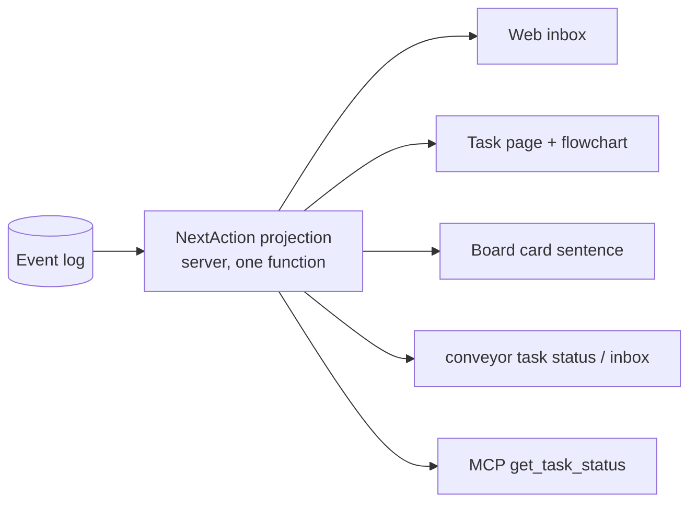
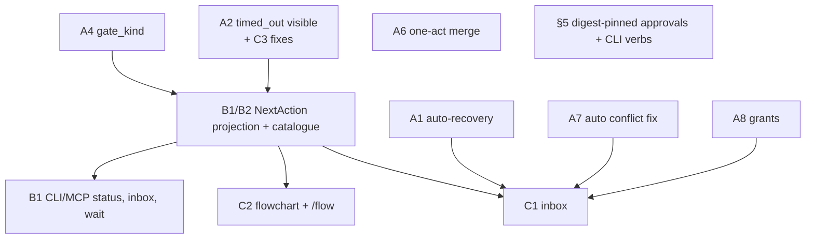

# Proposal: state visibility and judgment-only stops

Companion to [analysis.md](analysis.md); section numbers like "§6 #12" point there.
Nothing here is filed or implemented.
Each change lists the corpus documents it would revise, taken from the traceability comments at the code it touches; the live corpus was not read, so wording and current versions must be checked before proposing.
Citations verified against 1c70303e.

## Contents

1. [Design rule](#1-design-rule)
2. [Group A: state machine and workflow](#2-group-a-state-machine-and-workflow)
3. [Group B: agent CLI and MCP](#3-group-b-agent-cli-and-mcp)
4. [Group C: web UI](#4-group-c-web-ui)
5. [Planning approvals and the CLI ledger idea](#5-planning-approvals-and-the-cli-ledger-idea)
6. [Corpus changes to propose](#6-corpus-changes-to-propose)
7. [Order of work](#7-order-of-work)
8. [Operator decisions (2026-10-10)](#8-operator-decisions-2026-10-10)
9. [Harness-neutral skills and CLI](#9-harness-neutral-skills-and-cli)
10. [Must-ship bug: recover leaves verify orders unclaimable; restart returns 500](#10-must-ship-bug-recover-leaves-verify-orders-unclaimable-restart-returns-500)
11. [Bug: a pull request merged on GitHub leaves a merge-gated task stuck at approved](#11-bug-a-pull-request-merged-on-github-leaves-a-merge-gated-task-stuck-at-approved)

## 1. Design rule

An operator stop exists only when the owner would choose differently depending on what the page shows.
Everything else is Conveyor's job, done automatically within a bound, and recorded where the owner can read it.

One server-side projection, the **next action**, answers for every task: who acts next, what kind of act it is, the question in plain words, what each choice does, what happens if nobody acts, and by when.
The board, the task page, the inbox, `conveyor` CLI, and MCP all read that one projection instead of the four derivations in use today (analysis §1).



`NextAction` shape (new, additive):

```text
who:          agent | conveyor | operator | dependency | nobody(terminal)
kind:         plan_approval | merge | review_loop_limit | agent_question
              | plan_revision | verification_disposition | document_proposal
              | triage_parked | drift | escalated_unblock | waiting | working
judgment:     true | false
summary:      "Checking: verify is re-running after an automatic retry."
question:     plain-language question (operator kinds only)
choices:      [{label, effect, action_ref}]
if_ignored:   "Expires at 17:14 and Conveyor retries (attempt 2 of 3)."
deadline:     timestamp | null
blocked_by:   [{task_id, title, state}]
current_order:{id, stage, clocks:{queue, execution, lease}}
details:      machine IDs, reason codes (collapsed in UI)
```

## 2. Group A: state machine and workflow

### A1. Bounded automatic recovery of mechanical failures

Today: `timed_out`, lease-expired, `stale`, and retry-limit orders wait for an operator recover or redispatch (analysis §6 #11–14).
Change: the order-clock worker applies `order.recover` / `order.redispatch` itself as a system actor, up to a bound of 2 automatic recoveries per order per 24h with exponential backoff (operator decision Q1a; a workspace can override it), then escalates as `escalated_unblock` with the last failure text.
Exclusions, which stay human: identical consecutive failure (A3), checkpoint with `decision_request` (A5), verification `operator_action_required`, pending plan revision (recover is already refused there, `internal/workorder/service.go:377-386`).
Execution deadlines become soft (A10): A1 covers orders that actually stopped (lease lapsed and no live session, `stale`, retry limit), never an attempt that is still running.
Code: `internal/dispatch/queue.go` order-clock worker, `internal/taskops/taskops.go` `TickOrderClock`, `internal/store/postgres/work_orders_store.go:1614-1655`, and the memory mirror.
Lifecycle table unchanged; only the permitted actor on W13/W14 edges changes.

### A2. Make every mechanical stall visible

`StalledTask` flags `timed_out` orders regardless of `retry_suppressed` (`internal/store/tasks_store.go:223-232`).
Pure projection fix; ship first, independent of A1.

### A3. Identical failures become a typed question, not a frozen order

Keep the stop, but the inbox item shows the repeated failure text and offers: "Retry once", "Wait for task X" (adds a dependency, which already pauses the queue clock, `internal/store/postgres/work_orders_store.go:1591-1613`), or "Close".
This turns the FunnelFlux PR #1568 case ("frozen since 2026-10-01 by a known tooling bug") into one dependency link that unblocks itself when the fix merges.

### A4. Durable gate kind on `awaiting_human`

Add `gate_kind` to the task projection (spec, plan_revision, merge, review_loop_limit, job_failed, set by the command that enters `awaiting_human`).
No new states; the code already notes that state alone is ambiguous (`internal/dispatch/dispatch.go:1500-1502`).
It removes the event-walking in `taskRunGate` and `gateFor` and makes the spec and merge gates distinguishable on the board.

### A5. Agent questions get an answer, not a "Recover" button

A checkpoint release with `decision_request` already carries the question and citations, and recover already accepts an operator `direction` (`internal/httpapi/phase47.go:99-103,122`).
Change only the contract presented: the inbox shows the question with the cited documents and pending proposal IDs, and the answer field becomes the `direction`.
No new endpoint.

### A6. Merge in one act

With the merge gate on, `awaiting_human` (gate.merge) currently needs approve, then merge (analysis §6 #2).
Add a lifecycle command `intervention.merge` from `awaiting_human` at the merge gate to `approved`-then-`merge.confirm` in one write when merge readiness is MERGEABLE, falling back to `approved` otherwise.
Also add the `running → approved` edge the code asks for (`internal/store/work_orders_store.go:1164-1167`), so auto-approval stops passing through `awaiting_human`.

### A7. Conflicts and "behind base" handled without a person

Already on main: when the merge gate is off, a CONFLICTING merge readiness dispatches the conflict fix automatically (`internal/dispatch/merge.go:184-190,584-591`), bounded to 3 failed dispatches before `merge.conflict_dispatch_exhausted` (`internal/dispatch/merge.go:419-425`).
Remaining change: do the same at `approved` with the merge gate on, where the operator still clicks "Fix merge conflict" (`web/src/components/task/review-panel.tsx:87-96`; `internal/dispatch/merge.go:592`).
Before a verify or review dispatch, if the PR head conflicts with base, dispatch the same conflict fix instead of a verify order.
This removes the FunnelFlux need to obtain a grant just to prove a branch conflicts.

### A8. Grants: none for read-only kit checks, standing grants for the rest

- Repository-manifest kit exercises that declare only `filesystem_read` inside the task worktree get a system grant bound exactly like an operator grant (context, attempt, revisions, subject, contract digest).
- Network, credential, write, and `operator_interaction` keep operator grants.
- Operator grants may be issued before a claim, as a task-scoped standing grant for a named kit and permission set with an expiry, consumed by each later attempt; this removes the race with the execution deadline (FunnelFlux stop 2).
- Kit pin drift (operator decision Q3): a kit whose pins are older versions of the same documents stays eligible; the selection receipt and the review show a drift warning, and the exact-version rule (`internal/verification/selection.go:73-76`) is relaxed accordingly.

### A9. Automatic retries for forge writes and review-round recovery

GitHub publication failures and interrupted or timed-out review seats retry automatically once with backoff, then escalate (analysis §6 #4, #18, #19).

### A10. No hard execution deadline; a missed check-in means "may be stuck", not "taken away"

Operator position (mockup review): a fixed time limit on a stage is wrong when a verify or implement attempt can legitimately take 30 minutes or 2 hours (provider outages, real extra work).
Today the attempt has a fixed execution deadline that forces `timed_out` (`internal/store/postgres/work_orders_store.go:1683-1687`), and an expired lease ends the claim: the next claim attempt expires it and answers "lease expired; operator recovery is required" (`internal/store/postgres/work_orders_store.go:1157-1164`).
Nothing hands running work to another agent automatically, but after an operator recover a second agent can claim while the first session is still alive, which is the confusion the operator describes.
Change:
- Execution time becomes informational: show elapsed against a typical duration for that stage and repository, and flag "taking longer than usual"; no forced `timed_out` while check-ins continue.
- Check-ins run on a timer, not at milestones: a self-claimed session today renews only at progress milestones (`docs/playbooks/conveyor-work.md:179-185`) against a 5-minute default lease (`internal/core/types.go:583`). A `conveyor order keepalive` background process renews on a timer for any harness (skills-review §7 item 8).
- A missed check-in marks the attempt "may be stuck" and notifies; it does not release the claim.
- Reclaim needs evidence that the session is gone: an explicit release, the harness reporting the session ended, or 1 hour with no check-in (operator decision Q1b), after which A1 may recover.
- An operator recover of a session that is still checking in is refused or requires confirmation that names the live session.
Corpus: execution-deadline and lease semantics in `component-task-lifecycle` and `component-work-orders`; needs a DEC because it reverses the fixed-deadline rule.

### A11. Claims record harness, model, and user

The operator wants every stage to show who is running it and how, e.g. "OMP · Claude Opus 5.5 · Zeno".
`claim_work_order` already requires `agent` and `model` (`internal/httpapi/mcp.go:295`, schema `:909`) and stores the owner user (`mcp.go:297`); `report_continuation` carries `harness` (`mcp.go:433`) but is optional.
Change: make `harness` (name and version) a claim argument alongside `agent` and `model`, and project claimant user, harness, model, session ID, attempt ID, claimed-at, last check-in, and last progress message on the order and in `NextAction`.

Effect on the FunnelFlux session (inputs/operator-experience-analysis.md §1): stops 1, 2, 3 disappear (A7, A8, A1), stop 4 becomes a dependency link (A3), stop 6 is A7, stop 5 (plan approval) remains, which is the one real decision.

## 3. Group B: agent CLI and MCP

### B1. One "what do you need from me" query

- REST: `GET /v1/tasks/{id}/next-action` and `GET /v1/next-actions?who=operator` (workspace inbox).
- CLI: `conveyor task status <id>` prints the summary, who acts, the question, choices, deadline, and blockers; `conveyor inbox` lists operator items, judgment first, ordered by dependency then deadline.
- MCP: `get_task_status` (readable by user credentials and by the claiming agent for its own task) and `list_operator_inbox` (user credentials).
- `conveyor task wait` exists on `origin/main`; extend it with `--until operator|terminal|stage=<s>` and print each `NextAction` change.

### B2. Plain-language reason catalogue

One server table maps every stall reason, gate kind, and release outcome to: label, sentence, what each choice does, what happens if ignored.
Today the strings live in `internal/store/tasks_store.go:224-232`, `web/src/lib/activity.ts:220-229` and `:487-664`, `web/src/components/task/review-panel.tsx:85-154`, and `cmd/conveyor/run_cmd.go:187-213`.

### B3. Missing operator commands for terminal-first operators

Already on main: `conveyor task merge` (`cmd/conveyor/main.go:463-482`) and `conveyor verification permissions inspect|grant|revoke` (`cmd/conveyor/verification_permissions.go:21-25,52`).
Remaining: `conveyor order recover <id> [--direction]` and `conveyor order redispatch <id>`, each a thin client over the existing endpoint and capability.
Most become rare once A1, A7, and A8 land; they remain for escalations.

### B4. Fewer per-step grants

Covered by A8: one standing grant per task and kit instead of one per attempt.

## 4. Group C: web UI

See the mockup ([mockups/index.html](mockups/index.html)).

### C1. Operator inbox replaces the "Needs operator" column

Three bands:

1. **Decisions** (judgment only): plan approval, merge, review loop limit, agent question, plan revision, verification disposition, document proposals, triage park, drift.
   Each card: task title and PR, what you are deciding, the requirement it serves, the agent's recommendation and reason, two or three choices, what happens if ignored, deadline; machine IDs collapsed.
   Every card opens its context in a side sheet without leaving the page: the full plan (Approach, Files touched, Ordering, Risks, Done criteria) for plan approval, cited requirement and design excerpts plus the pending proposal for agent questions, last reviewer feedback against the implementer reply for review loops, the operation log for verification.
   Merge cards also link out to the pull request on GitHub.
2. **Blocked by other tasks**: tasks waiting on another task's work (dependency or conflict), with nothing for the operator to do; each row shows "waits for → blocker" and links to it. Anything waiting on the operator is a Decision, never in this band.
3. **Handled automatically**: collapsed log of A1/A7/A9 actions; escalated mechanical items appear as one line, one button, labelled "No judgment needed".

Order: blockers before dependents, then nearest deadline.
The board keeps its stage columns but uses the new card: title, one plain sentence (`NextAction` summary), who-acts chip, and a clickable stage stripe showing steps and decision points; columns are wider (about 22–26rem) and the board scrolls horizontally.
There is no "Needs operator" column; it becomes a count in the header that links to the inbox (operator decision Q2).
The existing `GET /v1/attention/tasks` (`internal/httpapi/server.go:1431-1461`) is the natural base for "assigned to me"; it is unused today (`web/src/lib/api.ts:265-267`).

### C2. Per-task state flowchart

On the task page, above the timeline: a vertical (top-to-bottom) stage flow Triage → Plan → ◆Plan gate → Implement → Verify → Review → ◆Merge gate → Merged, with side nodes Waiting on dependency, Auto-retrying, Needs you, Parked, Closed to the right of the stage they attach to.
Vertical because eight stages in one row do not fit varying browser widths; vertical scroll is free.

- Visited path solid, future dashed, current node highlighted, bounce loops as back-edges on the left with a count.
- A stage with an agent currently working shows a subtle live indicator; waiting and verification states stay static; respects `prefers-reduced-motion`.
- Stages switched off for this task (gate off, verify off) are greyed with "off for this task", read from the frozen policy.
- Clicking a node (or the same stage on a board card's stage stripe) opens a side sheet: stage name with its one-line description as subline and a status word ("In progress", "Waiting", "Done", "Skipped", "Needs you"); first a "Current attempt status" block (harness, model, user, session and attempt IDs, claimed at, last check-in, last progress, elapsed against typical, per A10/A11); then the attempt history with superseded attempts collapsed.
- The single pending action sits under the chart with the plain reason.
- "Show raw state" reveals `state`, `next_stage`, order IDs.

Data: a new `GET /v1/tasks/{id}/flow` projection derived from the event log (stage entries, bounces, gate entries and exits, order supersession), consistent with the rule that the graph is a rebuildable projection (docs/concepts.md "The knowledge graph").
The static diagram for the whole machine (`/v1/lifecycle-diagram`) stays a reference view on the Requirements or System Design page.

### C3. Fixes that need no new design

- `job.timeout` panel stops offering "Approve" (`web/src/components/task/review-panel.tsx:135-143`).
- `approved` with merge gate off leaves the Needs-operator set, and so the header count (`web/src/lib/activity.ts:88`).
- Spec gate and merge gate get different chips (`web/src/lib/activity.ts:227`), after A4.

### C4. Visual polish track (secondary, operator-owned)

The operator raised general visual quality: inconsistent typography, dense text in narrow spaces, and poor wrapping.
This is lower priority than C1–C3 and the operator plans to do it himself, so it is listed as a separate track, not mixed into the workflow changes.
The mockup shows the direction: a five-step type scale (24/600 page, 16/600 card title, 14 body, 12 meta, 11/600 uppercase label), 1000–1160px content width, 20–24px card padding, summary-first cards with detail on demand, and `overflow-wrap:anywhere` for IDs.

Findings from the mockup pass (design-master, read-only; paths under `web/src/`, not re-verified line by line):

| Issue | Where | Suggested fix |
|---|---|---|
| Three section-label styles (11px/.08em, 10px/.12em faint, 10px tracking-wider) | `components/task/timeline.tsx:341`; `attention-surface.tsx:49`; `document-tree.tsx:171,180`; `lineage-explorer.tsx:96`; `planning-chat.tsx:249`; `version-diff.tsx:182,347` | One `<Label>` component |
| Page `h1` is `text-lg` on some pages, `text-xl` on others | `board.tsx:79`, `requirements.tsx:229`, `system-design.tsx:200`, `planning.tsx:84` vs `tasks.tsx:122`, `settings.tsx:31`, `pending-proposals.tsx:96` | One `<PageHeader>` |
| Page subtitle `text-xs` vs `text-sm` | `requirements.tsx:230`, `system-design.tsx:201`, `planning.tsx:85` vs `pending-proposals.tsx:97`, `monitor.tsx:31` | `text-sm`, `max-w-prose`, inside `PageHeader` |
| Off-scale `text-[13px]`, illegible `text-[9px]`, `text-[10px]` as body | `task-header.tsx:154`; `assignee-chip.tsx:36`, `workspace/field.tsx:11`, `requirements.tsx:1509`; `task-sheet.tsx:62`, `timeline.tsx:947,959,1012`, `verification-entry.tsx:418,832` | Snap to the 11/12/14 steps |
| Board card leads with mono repo/ID and red raw failure text clamped to 2 lines | `board/task-card.tsx:48,85-90` | One plain sentence (the `NextAction` summary); detail on the task page |
| Narrow board columns wrap titles to 2–3 lines | `board/board-column.tsx:56` | ~20rem minimum or fewer columns |
| Blocker / retry / next facts crammed into a 3-column `text-xs` row | `task/timeline.tsx:352` | Stack them, label 11 + value 14 |
| `break-all` splits normal words | `workspace.tsx:354,646`, `personal-tokens-card.tsx:106` | `overflow-wrap:anywhere` |
| Markdown wrapping fix only applies inside panels | `styles.css:128-130` | Make it the default for prose and code |

## 5. Planning approvals and the CLI ledger idea

The developer's idea: replace in-app planning approvals with `conveyor plan approve <item-id>` recording the item hash, so drafts can be presented in Lavish or chat.

What the code has today:

| Approval | Pin today | Site |
|---|---|---|
| Plan (spec) gate | none; body is `{action, reason_code, comment}` | `internal/httpapi/server.go:761-765` |
| Requirement / System Design version confirm | version in path plus `If-Match` current version | `internal/httpapi/requirements.go:383-390` [SurfaceScout] |
| Decision confirm | none | [SurfaceScout] |
| Planning bundle approve | none | `internal/httpapi/planning.go:129-160` [SurfaceScout] |

Assessment.

- **Hash pin: adopt, on every approval.** "Approve what I saw" is the real gap: a plan approval today approves whatever spec is current at write time, not the version the operator read.
  Add `approved_digest` (SHA-256 of the canonical rendered item) to plan-gate approval, plan-revision decision, decision confirm, and planning-bundle approve; the server refuses on mismatch, as `If-Match` already does for documents.
- **CLI verb: adopt as another client, not a replacement.** `conveyor plan approve <item-id> --digest <sha>` (and `reject`, `redirect`) calls the same endpoints as the web buttons.
  The approval record stays the server event log; a separate local ledger would be a second source of truth and conflicts with AGENTS.md ("Do not introduce another persistence or queue dependency") and with the event log being the ledger the knowledge graph is rebuilt from.
- **Presentation in Lavish or chat: adopt.** Any surface can show the item if it shows the digest; the operator approves by digest, so it does not matter where they read it.
  `conveyor plan show <item-id>` prints canonical text plus digest for agents to render.
- **Risk: agents approving their own work.** Operator endpoints accept any user credential with the capability, and the CSRF proof applies only to browser sessions (`internal/httpapi/server.go:492,713-722`).
  An agent session holding the operator's personal token can already call `POST /review`; a convenient CLI verb makes that one command.
  AGENTS.md says agents never perform operator-only acts, but nothing in code enforces it for PATs.
  Options considered: (a) record provenance on every approval event and show it in the inbox; (b) a step-up for approvals from bearer tokens; (c) leave as is.
  Operator decision Q4: (a) only, no step-up. Every approval event records channel (`web`, `cli`, or `mcp`), credential ID, and agent identity, shown in the inbox and task history.
  This fits the soft-gate rule in §9: an agent may record an approval when the operator states it explicitly in the conversation.
- **Replace the in-app approval?** No. The web inbox stays the default for owners who are not in a terminal; the CLI path is parity, not replacement.

## 6. Corpus changes to propose

IDs are those cited in code at the touched sites; confirm wording and current versions in the live corpus before filing.

| Change | Documents to revise | New decision |
|---|---|---|
| A1 automatic bounded recovery | `component-task-lifecycle` (actor on W13/W14 recover/redispatch edges), `req-task-lifecycle-and-queue`, `component-work-orders` | DEC: "Mechanical recovery is automatic and bounded; operators are asked only after the bound, with the failure." |
| A2 timed_out shown as stalled | `component-web-dashboard`; REQ-2 AC-2.2 as cited at `web/src/lib/activity.ts:81` | — |
| A3 identical-failure question | `component-work-orders` | — |
| A4 gate kind | `component-task-lifecycle`; REQ-2 AC-2.1 and `component-work-orders` as cited at `internal/dispatch/dispatch.go:1502`, `internal/workorder/service.go:383-384` | — |
| A5 answerable checkpoints | `component-attempt-checkpoints` (cited by docs/playbooks/checkpoint-recovery.md), `component-work-orders` | — |
| A6 one-act merge, `running → approved` | `component-task-lifecycle` transition table | — |
| A7 automatic conflict fix with the merge gate on | `component-git-delivery` | — |
| A8 read-only kit auto-grant, standing grants | `req-verification-kits`, `component-verification-kit-contract`, `component-verification-strategy`, `req-security-boundaries` | DEC: "Read-only repository kit checks need no operator grant; external scopes do." |
| A9 forge and review-round retries | `component-git-delivery`, `component-task-lifecycle` | — |
| A10 soft execution time, check-in means "may be stuck" | `component-task-lifecycle`, `component-work-orders`, `req-task-lifecycle-and-queue` | DEC: "Running attempts are never timed out or reclaimed while they check in; elapsed time is informational." Supersedes the fixed execution-deadline rule. |
| A11 claim identity (harness, model, user) | `component-http-api`, `component-mcp-protocol`, `component-work-orders` | — |
| B1–B3 NextAction, status, inbox, commands | `component-http-api`, `component-mcp-protocol`, `req-task-centric-operations-view` (cited at `web/src/lib/activity.ts:231`) | DEC: "One server projection is the source of every 'what next' answer." |
| C1 inbox | `component-web-dashboard`, `req-task-centric-operations-view`; DEC-19 and `req-260810-23b69f` REQ-3 (caller inbox, `internal/httpapi/server.go:1434`) | — |
| C2 task flowchart and `/flow` | `component-web-dashboard`, `component-http-api` | — |
| §5 digest-pinned approvals, CLI approve verbs, approval provenance (channel, credential ID, agent identity) | `req-document-operating-surfaces`, `component-document-corpus`, `req-cli-authentication`; DEC-17 if plan-gate semantics change | DEC: "Every approval names the digest of what was approved and records its provenance." |

Unchanged and still binding: DEC-10 (recovery never rewrites history), DEC-12 (decision supersession), DEC-17 (gates frozen at intake), DEC-18 (priority, assignment, queue order), DEC-60 per docs/tasks.md:36-38 (agents may turn gates on, never off).

## 7. Order of work



First batch, before anything else: the §10 bug fix (recover refreeze, restart error mapping) with its regression tests.
A2 and C3 are projection fixes and can go first.
A1, A7, A8 need corpus decisions (§6) before implementation; the operator decisions they depend on are in §8.

## 8. Operator decisions (2026-10-10)

- Q1a, auto-recovery limit: default of 2 automatic recoveries per order per 24h with exponential backoff; a workspace can override it (A1).
- Q1b, silence limit: a session counts as gone after 1 hour with no check-in; before that, a missed check-in only shows "may be stuck" (A10).
- Q2: the "Needs operator" board column becomes a count in the header that links to the inbox; there is no column (C1).
- Q3, kit pin drift: an older version of the same document stays eligible; the selection receipt and the review show a drift warning, and the exact-version rule is relaxed (A8).
- Q4, token approvals: record provenance only (channel web/cli/mcp, credential ID, agent identity) on every approval event and show it in the inbox and task history; no step-up (§5).
  This fits the soft-gate rule: an agent may record an approval when the operator states it explicitly in the conversation.
- Q5: superseded by §9, as already written.
- Skills review: the Codex `conveyor-operator` plugin shrinks to a pointer to the canonical skills.

## 9. Harness-neutral skills and CLI

Operator goal: Conveyor is the coordination and communication layer (server, CLI, MCP, skills); it states process, state, requirements, and evidence rules, and never launches or controls the agent.
Any harness (OMP, Cursor, T3 Code, Codex, Claude Code) must be able to comply using a shell and the CLI, with MCP optional.
Full review: [skills-review.md](skills-review.md).
Headline findings (citations in the review):

- The canonical `conveyor-work` playbook carries launcher modes, per-harness launch tables, MCP registration styles, and memory-only preferences; move these to a non-normative harness-notes reference and replace them with a capability contract.
- The pasted `conveyor-coordinate` skill ([inputs/conveyor-coordinate.SKILL.md](inputs/conveyor-coordinate.SKILL.md), not in the repo or on `origin/main`) conflicts with DEC-45 (decisions recorded only on direct operator instruction) and with the self-claimed delivery loop, and depends on threads, agent memory, and a missing reference file.
- A harness without native MCP cannot comply today: the CLI lacks claim, renew, contract, progress, and verdict commands, and planning uses raw REST with a hard-coded workspace.
- Launcher coupling is still in the product: pinned-model enforcement on review claims, worker claims recorded as `agent="worker"`, and `report_continuation` refused for agent credentials; these become declarative requirements plus self-reported identity (A11).
- `repo init` writes four tool directories regardless of which tools exist and has no `.agents/skills` target; the review recommends one canonical location plus a `.claude/skills` copy.

Operator decisions (2026-10-10), detail in [skills-review.md §7](skills-review.md#7-operator-decisions-2026-10-10):

- Plan approval and merge are soft gates that wait for human judgment: never automatic, recorded either in the UI or by an agent on the operator's explicit statement in its conversation, both equivalent. Coordinators decide only mechanical steps. DEC-45 stands.
- No machine-wide harness or model config; each harness self-identifies (harness, model, user) on every claim, as A11 proposes, and the skills say so.
- `conveyor run` and `conveyor worker` remain optional adapters that skills do not mention.
- MCP stays a required capability where CLI parity is missing.
- `conveyor-work` carries no harness launch steps; those become non-normative notes at most.
- `conveyor-coordinate` is a developer's uncommitted skill; it should arrive rewritten to these decisions.
- `repo init` writes skills to one neutral, git-ignored folder and prints install instructions; copying into tool folders is opt-in.

## 10. Must-ship bug: recover leaves verify orders unclaimable; restart returns 500

First batch, ahead of every other item.
This is a correctness fix, not a UX change.
Source: two live reports in workspace `funnelflux-pro`, CLI v0.37: task 260928-4144ee (below) and task 260928-76f357 (§10.1).
Verify order `260928-4144ee-verify-8` timed out.
The operator recovered it from the dashboard and it went to `queued`.
Every claim was then refused with `verify order ... does not match task policy, stage, or submitted head`, even though the order head, the task's `reviewed_head_sha` and the PR head were all `0686652ac`, `next_stage` was `verify`, and `policy_version` was 1.
`conveyor task restart` then returned 500 twice (request ID `restart-260928-4144ee-20261010`, 06:36Z to 06:37Z) and left the task unchanged.
Code below is cited against origin/main 1c70303e.

### 10.1 Claim refusal after recover

The refusal comes from `ValidateVerifyDispatch` (`internal/core/verify_stage.go:32-39`), which every claim path calls (`internal/store/postgres/work_orders_store.go:1011`, the memory store at `internal/store/work_orders_store.go:1491`, and SingleStore at `internal/store/singlestore/work_orders.go:985`).
It requires four things: the task's frozen `setup_contract.verify_stage` is true, `next_stage` is `verify`, the order has a head, and that head equals `VerifyStageHead(task)`.
The report rules out the last three, except for one corner: `VerifyStageHead` returns `refresh_head_sha` instead of `reviewed_head_sha` when `approval_stale` is set (`verify_stage.go:7-12`), and the report does not list those two fields.

Root cause in code: operator recover rewrites the task's frozen contract from the workspace defaults.
- The dashboard calls `POST /v1/work-orders/{id}/recover` (`internal/httpapi/server.go:260`), then `recoverWorkOrder` (`internal/httpapi/phase47.go:94-128`), then `Service.RecoverVerification` and `Service.Recover` (`internal/workorder/service.go:334-395`).
- `recoveryRefreeze` ignores the task (`_ = task`) and builds the new contract from `cfg.FreezePolicy()` (`service.go:397-408`).
- `FreezePolicy` sets `VerifyStage: c.Execution.VerifyStage`, the workspace default, and takes timeouts and seats from the default setup, not the task's setup (`internal/config/config.go:1956-1981`).
- The store writes it straight into `tasks.setup_contract` (`internal/store/postgres/work_orders_store.go:1484-1503`; the memory store at `internal/store/work_orders_store.go:2296-2303`; SingleStore at `internal/store/singlestore/work_orders.go:1337-1350`). It does not touch `next_stage`, does not bump `policy_version`, and never re-runs `ValidateVerifyDispatch` on the order it just re-queued.
- A task can legitimately run with verify enabled while the workspace default is off, through a per-task policy change (`internal/httpapi/policy_change.go:16-31`), or because the workspace default changed after the task was frozen.
  Recover then flips `verify_stage` to false while `next_stage` stays `verify`, so every claim fails the first check forever.
  The per-task policy change path reconciles `next_stage` when it toggles verification; the refreeze does not.
- `policy_version` stays 1, which is why the report saw nothing wrong with the policy.

Second live case, 260928-76f357 (PR #1568), observed by the coordinator.
The operator recovered `260928-76f357-verify-1` at about 08:47Z.
The order went to `queued`, `claimable: true`, `retry_suppressed: false`, with head `63abdcf6e`, equal to the task's reviewed head and the PR head.
`claim_work_order` refused it with the same error.
The task's frozen contract (v1) has no `verify_stage` key: `{max_bounces: 10, stage_timeouts: {…, verify: 1h}, review: {seats: [{}]}, refresh_review: delta}`.
That matches the mechanism above:
- `ExecutionSetup.MarshalJSON` writes `verify_stage` with `omitempty` and always writes `stage_timeouts.verify` (`internal/config/config.go:665-689`), so a missing key means false and the verify timeout tells you nothing.
- A task reaches `next_stage = verify` only while its contract has `verify_stage` true: `verifyReviewReadyTx` returns ready when it is false (`internal/store/postgres/verify_stage.go:10-13`), and only a not-ready task is routed from review to verify (`internal/store/postgres/lifecycle_store.go:38-51`).
  So verify-1 was created while the contract had verify on, and the key disappeared afterwards; the recover at 08:47Z is the only contract writer in the observed sequence.
- For 260928-4144ee, eight verify orders ran before verify-8 was refused, so verify was on before that recover too.
  Its post-recover contract was not in the report; the task-row query below settles it.
  This checkout has no access to the live system.

The underlying defect is that recover and claim disagree: recover accepts an order and reports success, and the claim check then rejects it.
The fix below makes them agree in both directions.

Proof needed from the live system (the code shows the mechanism, not that it fired for either task; run each query for both task IDs):
- Event: `SELECT at, actor_id, payload_json FROM events WHERE workspace_id='funnelflux-pro' AND task_id='260928-4144ee' AND kind='task.setup.refrozen' ORDER BY at;` A row at about 06:10Z with `prior.verify_stage=true` and no `verify_stage` in `new` confirms the cause; the event is written only when the contract changed (`work_orders_store.go:1496-1502`).
- Task row: `SELECT setup_contract->'verify_stage', next_stage, approval_stale, refresh_head_sha, reviewed_head_sha FROM tasks WHERE workspace_id='funnelflux-pro' AND id='260928-4144ee';` A null `verify_stage` confirms it.
  `approval_stale=true` with a different `refresh_head_sha` would point to the head corner instead.
- Workspace config: `execution.verify_stage` for `funnelflux-pro` at 06:10Z; false is consistent with the cause.

Fix:
1. Recover keeps the task's frozen contract.
   `recoveryRefreeze` starts from `task.SetupContract` and changes only what recovery is meant to refresh: the recovered stage's timeout, and execution pins, which are already cleared (DEC-56).
   Pipeline shape (`verify_stage`, `max_bounces`, review seats, refresh mode) changes only through the per-task policy change path, which reconciles `next_stage` and open orders.
   If the operator wants recovery to adopt new workspace defaults, that becomes an explicit option on the recover request, routed through the same policy change planner.
2. Recover re-validates inside its transaction: after the refreeze and before commit, run `ValidateVerifyDispatch` (and the stage equivalents) on the re-queued order.
   On failure, roll back and return 409 with the failing condition.
   Recovery must never report success while leaving an order that nothing can claim.
3. `ValidateVerifyDispatch` names the failing condition (`verify stage disabled in task policy`, `next_stage is review`, `order head X != verify head Y (refresh head)`), so a refused claim says what is wrong.
4. Repair for tasks already affected: an operator command or one-off migration that restores `verify_stage` from the last `task.setup.refrozen` event's `prior`, recorded as an audited operator act.
   If no `prior` with verify on exists, route the task back to review instead (`next_stage = review`, cancelling the stranded verify order), so it is never left at a stage its policy cannot run.
5. Recover and claim share one predicate.
   A single `ClaimableAfter(task, order)` check, the same one the claim path runs, decides whether the dashboard and CLI offer "Recover" at all.
   When it would fail, the order's page shows the failing condition and offers what would work: restore the task policy, change the task policy (which moves the task to review), or restart.
   The recover endpoint runs the same check after its writes (fix 2), so a stale page cannot recover a stranded order either.

### 10.2 Restart returns 500

The restart handler maps only four sentinel errors (`ErrTaskTerminal`, `ErrStartOverRequestConflict`, `ErrStartOverConfirmDocuments`, `ErrNotFound`) and turns everything else into a bare 500 (`internal/httpapi/task_start_over.go:56-69`).
Start-over runs in one transaction (`internal/store/postgres/task_start_over.go:18-199`), so any failure also rolls back the cancellation, which is why the task did not change.
The verify order's state is not the cause: restart is legal from every non-terminal state (`internal/core/lifecycle.go:102-107`), cancelling a queued or timed-out order is legal (`lifecycle.go:112,115`), and start-over creates no work orders.
Ranked causes, from code (not proven for this task):
1. About 55%: successor creation re-validates the inherited requirement and design attachments (`task_start_over.go:102-127`, then `validateTaskContextTx` at `internal/store/postgres/task_context.go:101-135`).
   It fails when an attached document is missing, archived, or has no confirmed version.
   One way to get there is a planning-bundle attachment still marked unconfirmed (`internal/store/postgres/planning_bundles.go:298-316`).
   The read model hides the problem by skipping such documents (`internal/store/task_context.go:125-143`).
   The conformance case `rollback_after_cancellation` (`internal/store/storetest/task_start_over.go:325-338`) reproduces this failure; through HTTP it becomes the 500.
2. About 20%: an unmapped database error inside the transaction, such as a 23505 on `tasks_supersedes_unique`, which `translateDriverError` does not map (`internal/store/postgres/backend_errors.go:29-38,100`).
3. About 25% combined: another domain error (dependency validation, proposal dismissal), a 500 from one of the CLI's preview reads before the POST, or a transient lock timeout.
   Two identical failures in a row make a transient cause unlikely.

Proof needed: the server log line `start task over: <error>` logged just before the 500 access-log line at 06:36Z to 06:37Z.
The handler's line carries no request ID, so match it by timestamp.
For cause 1, fold the task's `task.context_requirement_added/removed` and `task.context_design_added/removed` events, then check `current_version` and `archived_at` on the active documents.
The CLI's error prefix shows whether a preview GET failed (`read task preview:`, `read work-order preview:`, `read pending-proposal preview:`) or the POST did (a bare `500 Internal Server Error`).

Fix:
1. The restart handler maps every typed domain error to 4xx with its message: context reference and archived-document errors to 409 or 422, `ErrRetryable` to 503 with `Retry-After`, and branch-in-use to 409.
   A 500 is left only for real faults, and its body carries the request ID.
2. Start-over handles unavailable inherited context the same way the read model does: drop it from the successor, write an event that names each dropped document, and report the drops in the response, instead of failing the whole restart.
3. `translateDriverError` maps the remaining task constraints (`tasks_supersedes_unique`) to a conflict.

### 10.3 UX angle

Recover returned success and the order showed `queued`, so the board looked healthy while the task could never move.
Nothing on the task, the order or the inbox said why, and the claim error did not name the failing condition.
Restart, the documented way out, failed with no reason.
The operator worked around Conveyor by merging on GitHub and closing the task.
Under A2 and C1, "queued but unclaimable" becomes a visible stall: the projection runs `ValidateVerifyDispatch` on every queued order and raises an inbox item with the failing condition and the fixes on offer (restore task policy, change task policy, restart).
Any operator action that leaves the task unable to progress is refused with a reason, never accepted silently.

### 10.4 Regression tests

Each test runs in the storetest conformance suite against memory, PostgreSQL and SingleStore, plus the HTTP layer where noted.
- Recover keeps a per-task policy: the workspace sets `verify_stage` false and the task enables it through a policy change; a verify order times out and the operator recovers it.
  Expect the claim at `reviewed_head_sha` to succeed, `setup_contract.verify_stage` to stay true, the per-task verify timeout to be kept, and no `task.setup.refrozen` event.
- The workspace default changes after freezing: the task is frozen with verify on, then the workspace turns it off, then the operator recovers.
  Same expectations.
- Recover refuses an unclaimable result: craft a task where re-queueing would fail `ValidateVerifyDispatch` (for example `approval_stale` with a different `refresh_head_sha`).
  Expect recover to return 409 naming the condition, the order to keep its prior state, and no event to be written.
- The claim error names the failing condition, one case per condition (policy, stage, empty head, head mismatch).
- Restart with unavailable inherited context: extend `rollback_after_cancellation` through HTTP.
  The current behavior (500) changes to either success with a dropped-context event (fix 2) or a 4xx naming the document; it is never 500.
- Restart with each other mapped error (`ErrRetryable`, branch in use, supersedes conflict) returns its 4xx or 503, not 500.
- Invariant property test: from every non-terminal task state with one queued, stale or timed-out order of each stage, recover followed by claim either succeeds or is refused at recover, never at claim.
- Recover is offered only when the order would be claimable: for a task whose contract has `verify_stage` false and a queued, stale or timed-out verify order, the task view and the CLI do not offer recover. They show the failing condition, and a direct POST to the recover endpoint returns 409.
- Repair of a stranded task: with no `prior` that has verify on, the repair moves the task to review and cancels the verify order, and the next review order is claimable.
Mutation targets: each conjunct in `ValidateVerifyDispatch`, the refreeze field copy, and each case in the restart error switch.

## 11. Bug: a pull request merged on GitHub leaves a merge-gated task stuck at `approved`

Live report from the coordinator, workspace `funnelflux-pro`.
Task 261009-477f9a was `awaiting_human` at the merge gate.
The operator merged PR #1608 directly on GitHub at 08:45:32Z.
Conveyor did not notice; 39 minutes later the task was still `awaiting_human`.
At 17:00:55Z the operator ran `conveyor task approve 261009-477f9a`; the task moved to `approved` and stayed there, never reaching `merged`.
`conveyor done` refuses because the task is neither merged nor closed, and `task close` would record shipped work as cancelled.
The same day the server answered 503 "unconditional drop overload" twice at about 17:00Z.

### 11.1 Code path (origin/main 1c70303e; not proven for this task)

- The monitor's merged-PR observation calls `ReconcileObservedPullRequest` (`cmd/conveyord/main.go:430-432`).
  It returns without effect unless the task is `approved` or `merged` (`internal/dispatch/merge.go:644`), so a merge observed while the task waits at the merge gate is dropped and not retried.
- With the merge gate on, `approve` only moves the task to `approved`.
  The merge is a separate act, `POST /v1/tasks/{id}/merge` (`internal/httpapi`, wired to `MergeApprovedTask` at `cmd/conveyord/main.go:226`), which has no CLI command; that is the two-step merge proposal A6 removes.
- No background path covers merge-gated tasks: the readiness tick skips every task with `MergeApproval` set (`merge.go:794`), and the review-acceptance hook merges only when the gate is off (`internal/dispatch/dispatch.go:1156`).
- `MergeApprovedTask` already handles an already-merged PR: it calls `reconcileObservedMergeLocked`, which records `merge.reconciled` and moves the task to `merged` (`merge.go:550-551,679-715`).
  It is never invoked here.

Workaround for the stuck task [INFERENCE: from code, not run]: the dashboard's Merge action, which is the `POST /v1/tasks/261009-477f9a/merge` route, should reconcile it to `merged` without a forge write, because the PR reads as merged at the approved head.
If it refuses, its 409 text names the mismatch, for example a different head or `approval_stale`.

Proof needed: the task's events for a `monitor`/forge observation near 08:45Z with no following `merge.reconciled`, and the server log around 17:00Z for 503s on the approve request.

### 11.2 Fix

1. An observed merge at a merge-gated task (`awaiting_human` with the merge gate, `approved`, or `merged`) whose PR head equals the approved or reviewed head is reconciled to `merged` as `merge.reconciled` with `result: merged_outside_conveyor` and the forge's `merged_by`.
   The operator merging on the forge is the operator's merge decision (DEC-45); Conveyor records it rather than waiting for a second act.
   A merge at a different head is recorded as drift and raised in the inbox, never as `merged`.
2. The readiness tick also visits merge-gated `approved` and `awaiting_human` (merge) tasks, read-only: it reads the PR and reconciles an already-merged one, and never merges.
3. `approve` at the merge gate reads the PR first; if it is already merged at the approved head, it reconciles directly to `merged`.
4. Under C1 and DEC-61, a merge-gated task whose PR is merged appears in the inbox as a mechanical item that Conveyor clears itself, not as a decision.

### 11.3 Regression tests

- Merge-gated `awaiting_human` task: the monitor observes a merged PR at the reviewed head, and the task becomes `merged` with one `merge.reconciled` event; the same observation repeated adds no event.
- Merge-gated `approved` task with the PR already merged: the next readiness tick moves it to `merged` and calls no merge API.
- An observed merge at a different head leaves the state unchanged and records drift.
- `approve` on an already-merged PR ends in `merged`.
- `conveyor done` succeeds after each of the above.
